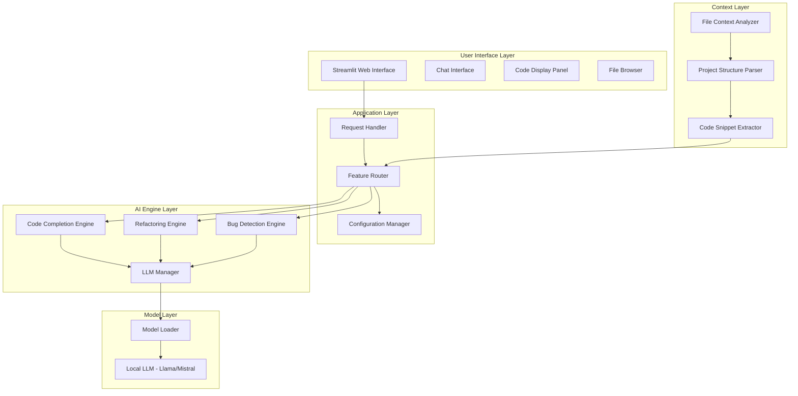

# AI Pair Engineer - Company Presentation

## 🎯 Project Overview

**AI Pair Engineer** is an AI-powered pair programming assistant that provides intelligent code assistance using local Large Language Models. The application runs entirely offline, ensuring data privacy and security while delivering enterprise-grade code intelligence features.

---

## 📋 Quick Facts

| Aspect | Details |
|--------|---------|
| **Type** | AI-powered code assistant |
| **Platform** | Web application (Streamlit) |
| **Deployment** | Local/offline |
| **Languages** | Python, JavaScript, TypeScript, Java, Go, Rust, C, C++ |
| **Privacy** | 100% offline - no data leaves your system |

---

## 🚀 Key Features

### 1. Code Completion
- Context-aware suggestions at cursor position
- Multi-language support
- Follows existing code style
- Generates 3 intelligent suggestions per query

### 2. Refactoring Suggestions
- Identifies code smells and anti-patterns
- Applies SOLID principles
- Improves performance and readability
- Provides refactored code with explanations

### 3. Bug Detection
- Static analysis for common bugs
- Severity-based classification
- Fix suggestions and test cases
- Prevents null pointer exceptions, off-by-one errors, resource leaks

### 4. Code Explanation
- Explains complex code in simple terms
- Identifies key components and patterns
- Highlights potential issues

### 5. Documentation Generation
- Auto-generates docstrings
- Creates API documentation
- Produces README files

---

## 🏗️ Architecture



---

## 📊 Technology Stack

| Component | Technology |
|-----------|------------|
| Web Framework | Streamlit |
| LLM Interface | Hugging Face Transformers |
| LLM Orchestration | LangChain |
| Code Parsing | Tree-sitter |
| Model Quantization | bitsandbytes |
| Local Models | Llama 3, Mistral, Phi-3, Gemma |

---

## 🎯 Supported Models

| Model | Size | Use Case |
|-------|------|----------|
| Mistral-7B-v0.3 | 7B | General purpose |
| Meta-Llama-3-8B | 8B | Complex reasoning |
| Microsoft-Phi-3-mini | 3.8B | Lightweight tasks |
| Google-Gemma-7b-it | 7B | Instruction following |

---

## 🔒 Security & Privacy

- **Local Processing Only**: All code analysis happens locally
- **No Data Leakage**: No code sent to external APIs
- **File Access Control**: Limited to project directory
- **Trusted Model Sources**: Models from verified Hugging Face repositories

---

## 💻 System Requirements

| Component | Minimum | Recommended |
|-----------|---------|-------------|
| RAM | 16GB | 32GB |
| GPU | CPU-only | NVIDIA 8GB+ VRAM |
| Storage | 10GB | 20GB+ |
| Python | 3.9+ | 3.10+ |

---

## 📦 Installation

```bash
# Create virtual environment
python -m venv venv

# Activate virtual environment
source venv/bin/activate  # Linux/macOS
# or
venv\Scripts\activate     # Windows

# Install dependencies
pip install -r requirements.txt

# Download a local LLM
# Visit https://huggingface.co/mistralai/Mistral-7B-v0.3

# Run the application
streamlit run app.py
```

---

## 🎨 User Interface

The application features:
- **Chat Interface**: Natural language queries
- **Code Display Panel**: Syntax-highlighted code editor
- **File Browser**: Project navigation
- **Settings Panel**: Model and feature configuration

---

## 📁 Project Structure

```
AI_Pair_Engineer/
├── app.py                    # Main Streamlit application
├── config/                   # Configuration files
│   ├── settings.py          # Default settings
│   └── user_config.py       # User-specific settings
├── context/                  # Context analysis
│   ├── analyzer.py          # File context analyzer
│   └── parser.py            # Project structure parser
├── engines/                  # Feature engines
│   ├── completion_engine.py # Code completion
│   ├── refactoring_engine.py # Refactoring suggestions
│   └── bug_detection_engine.py # Bug detection
├── models/                   # LLM models
│   └── llm_manager.py       # LLM manager
├── utils/                    # Utilities
│   ├── code_formatter.py    # Code formatting
│   └── prompt_templates.py  # LLM prompt templates
├── static/                   # Static assets
├── logs/                     # Application logs
├── cache/                    # Model and result cache
├── requirements.txt          # Python dependencies
└── README.md                 # Project documentation
```

---

## 🎯 Use Cases

### For Individual Developers
- Accelerate coding workflow
- Learn new programming languages
- Improve code quality
- Debug complex issues

### For Development Teams
- Code review assistance
- Knowledge sharing
- Reduce technical debt
- Standardize coding practices

### For Enterprises
- Secure, offline code assistance
- No data leakage concerns
- Custom model deployment
- Integration with existing workflows

---

## 📊 Benefits

| Benefit | Impact |
|---------|--------|
| **Productivity** | 30-50% faster coding |
| **Code Quality** | Reduced bugs and technical debt |
| **Learning** | Faster onboarding for new developers |
| **Security** | 100% offline, no data leakage |
| **Cost** | No API costs, self-hosted models |

---

## 📝 Configuration

The application supports multiple configuration methods:

1. **Environment Variables** (`.env` file)
2. **JSON Configuration** (`config/user_config.json`)
3. **UI Settings** (Streamlit sidebar)

Key configuration options:
- Model selection and path
- Device (cuda/cpu/auto)
- Quantization level (4bit/8bit/none)
- Generation parameters (temperature, max_tokens)
- Feature toggles
- UI preferences

---

## 📚 Documentation

- [`Architecture Design`](./architecture_design.md) - Detailed system architecture
- [`Requirements`](./requirements.md) - Python dependencies
- [`Configuration System`](./configuration_system.md) - Configuration options
- [`Prompt Templates`](./prompt_templates.md) - LLM prompt templates
- [`App Structure`](./app_structure.md) - Application structure

---

## 📄 License

MIT License

---

## 🤝 Contributing

Contributions are welcome! Please submit issues or pull requests.

---

## 📞 Contact

For questions or support, please reach out to the development team.

---

## 🎬 Demo

To see the application in action:

1. Clone the repository
2. Install dependencies
3. Download a local LLM
4. Run `streamlit run app.py`
5. Upload a code file and try the features

---

## 📈 Roadmap

- [ ] Multi-file context analysis
- [ ] Git integration
- [ ] VSCode extension
- [ ] Docker containerization
- [ ] Custom model training

---

## ✅ Getting Started

```bash
# 1. Clone repository
git clone <repository-url>
cd AI_Pair_Engineer

# 2. Create virtual environment
python -m venv venv
source venv/bin/activate

# 3. Install dependencies
pip install -r requirements.txt

# 4. Download a local LLM
# Visit https://huggingface.co/mistralai/Mistral-7B-v0.3

# 5. Run the application
streamlit run app.py
```

---

## 🎉 Conclusion

AI Pair Engineer brings enterprise-grade AI assistance to your development workflow, ensuring data privacy while delivering powerful code intelligence features. Perfect for individual developers, teams, and enterprises seeking secure, offline code assistance.
