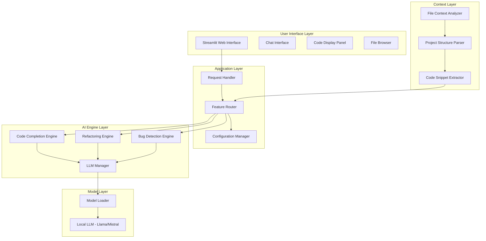

# AI Pair Engineer - Project Summary

## Executive Overview

**AI Pair Engineer** is an AI-powered pair programming assistant that leverages local Large Language Models (LLMs) to provide intelligent code assistance directly within developers' workflows. The application runs entirely offline, ensuring data privacy and security while delivering enterprise-grade code intelligence features.

---

## Key Features

### 1. Code Completion
- Context-aware code suggestions based on cursor position
- Multi-language support (Python, JavaScript, TypeScript, Java, Go, Rust, C, C++)
- Generates 3 intelligent completion suggestions per query
- Follows existing code style and conventions

### 2. Refactoring Suggestions
- Identifies code smells and anti-patterns
- Suggests performance improvements
- Applies SOLID principles and DRY methodology
- Provides refactored code with explanations

### 3. Bug Detection
- Static analysis for common bugs
- Identifies null pointer exceptions, off-by-one errors, resource leaks
- Provides fix suggestions and test cases
- Severity-based issue classification

### 4. Code Explanation
- Explains complex code in simple terms
- Identifies key components and patterns
- Highlights potential issues

### 5. Documentation Generation
- Auto-generates docstrings
- Creates API documentation
- Produces README files

---

## Technical Architecture



---

## Supported Models

| Model | Size | Use Case |
|-------|------|----------|
| Mistral-7B-v0.3 | 7B | General purpose |
| Meta-Llama-3-8B | 8B | Complex reasoning |
| Microsoft-Phi-3-mini | 3.8B | Lightweight tasks |
| Google-Gemma-7b-it | 7B | Instruction following |

---

## System Requirements

| Component | Minimum | Recommended |
|-----------|---------|-------------|
| RAM | 16GB | 32GB |
| GPU | CPU-only | NVIDIA 8GB+ VRAM |
| Storage | 10GB | 20GB+ |
| Python | 3.9+ | 3.10+ |

---

## Installation

```bash
# Create virtual environment
python -m venv venv

# Activate virtual environment
source venv/bin/activate  # Linux/macOS
# or
venv\Scripts\activate     # Windows

# Install dependencies
pip install -r requirements.txt

# Download a local LLM
# Visit https://huggingface.co/mistralai/Mistral-7B-v0.3

# Run the application
streamlit run app.py
```

---

## Configuration

The application supports multiple configuration methods:

1. **Environment Variables** (`.env` file)
2. **JSON Configuration** (`config/user_config.json`)
3. **UI Settings** (Streamlit sidebar)

Key configuration options include:
- Model selection and path
- Device (cuda/cpu/auto)
- Quantization level (4bit/8bit/none)
- Generation parameters (temperature, max_tokens)
- Feature toggles
- UI preferences

---

## Security Features

- **Local Processing Only**: All code analysis happens locally; no data sent to external APIs
- **File Access Control**: Limited to project directory
- **Input Sanitization**: All user inputs validated
- **Trusted Model Sources**: Models loaded from verified Hugging Face repositories

---

## Use Cases

### For Individual Developers
- Accelerate coding workflow
- Learn new programming languages
- Improve code quality
- Debug complex issues

### For Development Teams
- Code review assistance
- Knowledge sharing
- Reduce technical debt
- Standardize coding practices

### For Enterprises
- Secure, offline code assistance
- No data leakage concerns
- Custom model deployment
- Integration with existing workflows

---

## Project Structure

```
AI_Pair_Engineer/
├── app.py                    # Main Streamlit application
├── config/                   # Configuration files
│   ├── __init__.py
│   ├── settings.py          # Default settings
│   └── user_config.py       # User-specific settings
├── context/                  # Context analysis
│   ├── __init__.py
│   ├── analyzer.py          # File context analyzer
│   └── parser.py            # Project structure parser
├── engines/                  # Feature engines
│   ├── __init__.py
│   ├── completion_engine.py # Code completion
│   ├── refactoring_engine.py # Refactoring suggestions
│   └── bug_detection_engine.py # Bug detection
├── models/                   # LLM models
│   ├── __init__.py
│   └── llm_manager.py       # LLM manager
├── utils/                    # Utilities
│   ├── __init__.py
│   ├── code_formatter.py    # Code formatting
│   └── prompt_templates.py  # LLM prompt templates
├── static/                   # Static assets
├── logs/                     # Application logs
├── cache/                    # Model and result cache
├── requirements.txt          # Python dependencies
└── README.md                 # Project documentation
```

---

## License

MIT License

---

## Contributing

Contributions are welcome! Please submit issues or pull requests.

---

## Contact

For questions or support, please reach out to the development team.
