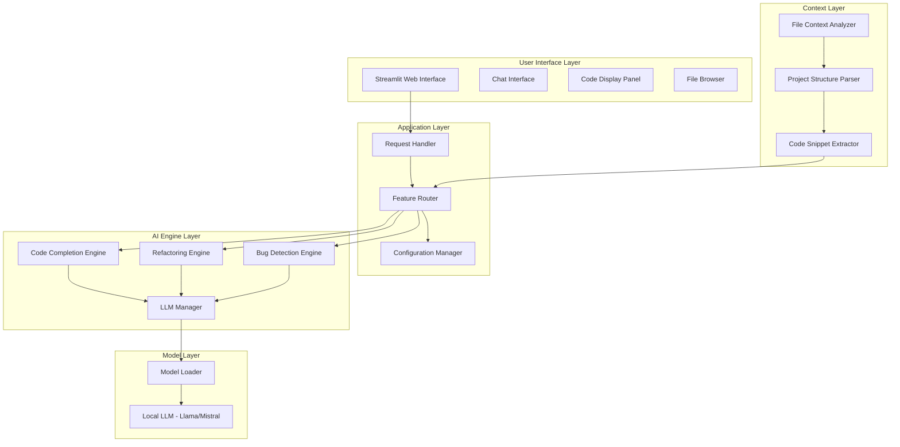
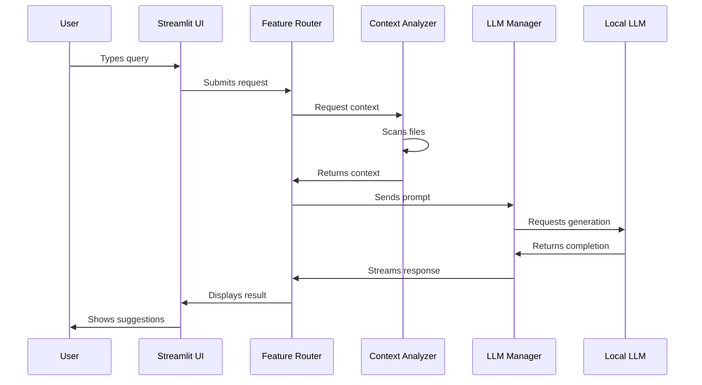

# AI Pair Engineer - Architecture Design

## Overview

AI Pair Engineer is a Streamlit-based web application that provides AI-assisted development features including code completion, refactoring suggestions, and bug detection using local LLMs.

## System Architecture



## Component Specifications

### 1. User Interface Layer

**Streamlit Web Interface**
- Chat-based interaction for natural language queries
- Code display panel with syntax highlighting
- File browser for project navigation
- Settings panel for configuration

### 2. Application Layer

**Request Handler**
- Parses user input from chat interface
- Routes requests to appropriate feature engines
- Manages conversation context

**Feature Router**
- Routes code completion requests to completion engine
- Routes refactoring requests to refactoring engine
- Routes bug detection requests to bug detection engine
- Handles multi-feature requests

**Configuration Manager**
- Loads model settings from config file
- Manages API keys and model paths
- Stores user preferences

### 3. AI Engine Layer

**LLM Manager**
- Manages local LLM connections
- Handles model loading and unloading
- Manages conversation history
- Implements streaming responses

**Code Completion Engine**
- Analyzes current cursor position
- Extracts relevant code context
- Generates completion suggestions
- Ranks multiple suggestions

**Refactoring Engine**
- Analyzes code structure
- Identifies refactoring opportunities
- Generates refactored code variants
- Explains refactoring rationale

**Bug Detection Engine**
- Analyzes code for common bugs
- Identifies potential issues
- Suggests fixes
- Provides test cases for bugs

### 4. Context Layer

**File Context Analyzer**
- Scans project directory structure
- Identifies relevant files based on query
- Extracts file contents
- Builds context window

**Project Structure Parser**
- Parses project configuration files
- Identifies dependencies
- Maps file relationships
- Builds dependency graph

**Code Snippet Extractor**
- Extracts code around cursor position
- Identifies function boundaries
- Captures relevant imports and types
- Formats context for LLM

### 5. Model Layer

**Local LLM Integration**
- Supports Llama 2/3 models
- Supports Mistral models
- Uses Hugging Face Transformers
- Implements quantization for efficiency

## Data Flow



## Technology Stack

| Component | Technology |
|-----------|------------|
| Web Framework | Streamlit |
| LLM Interface | Hugging Face Transformers |
| LLM Orchestration | LangChain |
| Code Parsing | Tree-sitter (via python-treesitter) |
| File Operations | Python standard library |
| Local Models | Llama 2/3, Mistral |
| Quantization | bitsandbytes |

## Configuration Structure

```
AI_Pair_Engineur/
├── app.py                    # Main Streamlit application
├── config/
│   ├── __init__.py
│   ├── settings.py           # Default settings
│   └── user_config.json      # User-specific settings
├── engines/
│   ├── __init__.py
│   ├── completion.py         # Code completion engine
│   ├── refactoring.py        # Refactoring engine
│   └── bug_detection.py      # Bug detection engine
├── context/
│   ├── __init__.py
│   ├── analyzer.py           # File context analyzer
│   └── parser.py             # Project structure parser
├── models/
│   ├── __init__.py
│   └── llm_manager.py        # LLM manager
├── utils/
│   ├── __init__.py
│   ├── code_formatter.py     # Code formatting utilities
│   └── prompt_templates.py   # LLM prompt templates
├── static/
│   └── styles.css            # Custom CSS
├── templates/
│   └── prompts/              # Prompt templates
├── logs/                     # Application logs
└── requirements.txt          # Python dependencies
```

## Prompt Strategy

### Code Completion Prompt
```
You are an AI pair programmer. Given the following code context and cursor position,
generate 3 code completion suggestions:

Context:
{code_context}

Current cursor position is at line {cursor_line}, column {cursor_col}

Generate 3 completion suggestions that:
1. Complete the current statement or expression
2. Follow the existing code style
3. Are contextually appropriate
```

### Refactoring Prompt
```
You are an AI pair programmer. Analyze the following code and suggest improvements:

Code:
{code_to_refactor}

Identify:
1. Code smells or anti-patterns
2. Performance issues
3. Readability improvements
4. Security concerns

Provide:
1. Refactored code
2. Explanation of changes
3. Benefits of refactoring
```

### Bug Detection Prompt
```
You are an AI pair programmer. Analyze the following code for bugs:

Code:
{code_to_analyze}

Check for:
1. Null pointer exceptions
2. Off-by-one errors
3. Resource leaks
4. Type mismatches
5. Logic errors
6. Security vulnerabilities

Report:
1. Found issues with line numbers
2. Severity levels
3. Fix suggestions
4. Test cases to verify fixes
```

## Security Considerations

1. **Local Model Only**: All processing happens locally; no data sent to external APIs
2. **File Access Control**: Limit file access to project directory
3. **Input Sanitization**: Validate all user inputs
4. **Model Loading**: Ensure models are loaded from trusted sources

## Performance Considerations

1. **Model Quantization**: Use 4-bit or 8-bit quantization for faster inference
2. **Context Window Management**: Limit context size to fit within model limits
3. **Streaming Responses**: Stream LLM responses for better UX
4. **Caching**: Cache common completions and analyses

## Next Steps

1. Create project structure
2. Set up Python environment
3. Implement context analyzer
4. Implement LLM manager
5. Implement feature engines
6. Build Streamlit UI
7. Add configuration system
8. Test and refine
