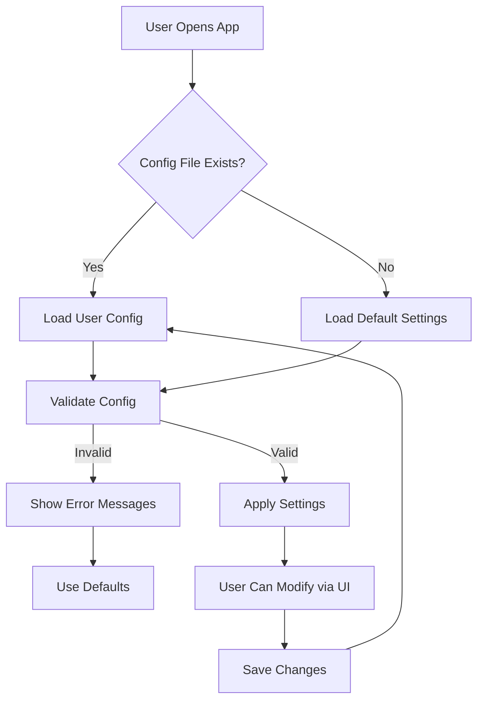

# AI Pair Engineer - Configuration System

## Overview

This document describes the configuration system for the AI Pair Engineer, allowing users to customize model settings, behavior, and preferences.

## Configuration Files

### 1. Default Settings (config/settings.py)

```python
"""
Default application settings.
These are loaded from environment variables or use sensible defaults.
"""

import os
from pathlib import Path

class Settings:
    """Application settings with environment variable support."""
    
    # Model settings
    MODEL_NAME = os.getenv(
        "MODEL_NAME",
        "mistralai/Mistral-7B-v0.3"
    )
    
    MODEL_PATH = os.getenv(
        "MODEL_PATH",
        None  # Auto-detect from MODEL_NAME
    )
    
    # Device settings
    DEVICE = os.getenv(
        "DEVICE",
        "auto"  # auto, cuda, cpu
    )
    
    # Quantization settings
    QUANTIZATION = os.getenv(
        "QUANTIZATION",
        "4bit"  # 4bit, 8bit, none
    )
    
    # Context settings
    MAX_CONTEXT_LENGTH = int(os.getenv(
        "MAX_CONTEXT_LENGTH",
        "8000"
    ))
    
    MAX_NEW_TOKENS = int(os.getenv(
        "MAX_NEW_TOKENS",
        "512"
    ))
    
    # Generation settings
    TEMPERATURE = float(os.getenv(
        "TEMPERATURE",
        "0.7"
    ))
    
    TOP_P = float(os.getenv(
        "TOP_P",
        "0.9"
    ))
    
    # Performance settings
    MAX_RETRIES = int(os.getenv(
        "MAX_RETRIES",
        "3"
    ))
    
    TIMEOUT = int(os.getenv(
        "TIMEOUT",
        "60"
    ))
    
    # Logging settings
    LOG_LEVEL = os.getenv(
        "LOG_LEVEL",
        "INFO"  # DEBUG, INFO, WARNING, ERROR, CRITICAL
    )
    
    LOG_FILE = os.getenv(
        "LOG_FILE",
        "logs/app.log"
    )
```

### 2. User Configuration (config/user_config.json)

```json
{
  "model_name": "mistralai/Mistral-7B-v0.3",
  "device": "auto",
  "quantization": "4bit",
  "max_tokens": 512,
  "temperature": 0.7,
  "top_p": 0.9,
  "features_enabled": {
    "code_completion": true,
    "refactoring": true,
    "bug_detection": true
  },
  "supported_languages": [
    "python",
    "javascript",
    "typescript",
    "java",
    "go",
    "rust",
    "c",
    "cpp"
  ],
  "max_files_in_context": 10,
  "context_window_per_file": 50,
  "cache_enabled": true,
  "cache_dir": "cache/",
  "ui_settings": {
    "theme": "dark",
    "font_size": "medium",
    "code_highlighting": true
  }
}
```

### 3. Environment Variables (.env)

```bash
# Model Configuration
MODEL_NAME=mistralai/Mistral-7B-v0.3
MODEL_PATH=/path/to/local/model
MAX_CONTEXT_LENGTH=8000
MAX_NEW_TOKENS=512

# Device Configuration
DEVICE=auto  # Options: auto, cuda, cpu
QUANTIZATION=4bit  # Options: 4bit, 8bit, none

# Generation Configuration
TEMPERATURE=0.7
TOP_P=0.9

# Performance Configuration
MAX_RETRIES=3
TIMEOUT=60

# Logging Configuration
LOG_LEVEL=INFO
LOG_FILE=logs/app.log

# Optional: API keys for external services
HF_TOKEN=hf_xxxxxxxxxxxxxxxxxxxxxx  # Hugging Face token
```

## Configuration Classes

### UserConfig Class

```python
"""
User-specific configuration manager.
"""

import json
import os
from pathlib import Path
from typing import Optional

class UserConfig:
    """Manages user-specific configuration."""
    
    def __init__(self, config_path: Optional[Path] = None):
        """Initialize configuration manager.
        
        Args:
            config_path: Path to configuration file. Defaults to config/user_config.json
        """
        self.config_path = config_path or Path("config/user_config.json")
        self._config = {}
        self._load_config()
    
    def _load_config(self) -> None:
        """Load configuration from JSON file."""
        if self.config_path.exists():
            try:
                with open(self.config_path, 'r') as f:
                    self._config = json.load(f)
            except json.JSONDecodeError as e:
                print(f"Error loading config: {e}")
                self._config = {}
    
    def save_config(self) -> None:
        """Save configuration to JSON file."""
        with open(self.config_path, 'w') as f:
            json.dump(self._config, f, indent=2)
    
    @property
    def model_name(self) -> str:
        """Get model name."""
        return self._config.get("model_name", "mistralai/Mistral-7B-v0.3")
    
    @model_name.setter
    def model_name(self, value: str) -> None:
        """Set model name."""
        self._config["model_name"] = value
    
    @property
    def device(self) -> str:
        """Get device for model loading."""
        return self._config.get("device", "auto")
    
    @device.setter
    def device(self, value: str) -> None:
        """Set device."""
        self._config["device"] = value
    
    @property
    def quantization(self) -> str:
        """Get quantization setting."""
        return self._config.get("quantization", "4bit")
    
    @quantization.setter
    def quantization(self, value: str) -> None:
        """Set quantization."""
        self._config["quantization"] = value
    
    @property
    def max_tokens(self) -> int:
        """Get max tokens for generation."""
        return self._config.get("max_tokens", 512)
    
    @max_tokens.setter
    def max_tokens(self, value: int) -> None:
        """Set max tokens."""
        self._config["max_tokens"] = value
    
    @property
    def temperature(self) -> float:
        """Get temperature for generation."""
        return self._config.get("temperature", 0.7)
    
    @temperature.setter
    def temperature(self, value: float) -> None:
        """Set temperature."""
        self._config["temperature"] = value
    
    @property
    def top_p(self) -> float:
        """Get top_p for generation."""
        return self._config.get("top_p", 0.9)
    
    @top_p.setter
    def top_p(self, value: float) -> None:
        """Set top_p."""
        self._config["top_p"] = value
    
    @property
    def features_enabled(self) -> dict:
        """Get enabled features."""
        return self._config.get("features_enabled", {
            "code_completion": True,
            "refactoring": True,
            "bug_detection": True
        })
    
    @features_enabled.setter
    def features_enabled(self, value: dict) -> None:
        """Set enabled features."""
        self._config["features_enabled"] = value
    
    @property
    def supported_languages(self) -> list:
        """Get supported programming languages."""
        return self._config.get("supported_languages", [
            "python", "javascript", "typescript", "java",
            "go", "rust", "c", "cpp"
        ])
    
    @property
    def max_files_in_context(self) -> int:
        """Get max files to include in context."""
        return self._config.get("max_files_in_context", 10)
    
    @property
    def context_window_per_file(self) -> int:
        """Get context window size per file."""
        return self._config.get("context_window_per_file", 50)
    
    @property
    def cache_enabled(self) -> bool:
        """Get cache enabled status."""
        return self._config.get("cache_enabled", True)
    
    @property
    def cache_dir(self) -> str:
        """Get cache directory."""
        return self._config.get("cache_dir", "cache/")
    
    @property
    def ui_settings(self) -> dict:
        """Get UI settings."""
        return self._config.get("ui_settings", {
            "theme": "dark",
            "font_size": "medium",
            "code_highlighting": True
        })
    
    def get_available_models(self) -> list:
        """Get list of available models."""
        return [
            "mistralai/Mistral-7B-v0.3",
            "meta-llama/Meta-Llama-3-8B",
            "microsoft/Phi-3-mini-4k-instruct",
            "google/gemma-7b-it"
        ]
    
    def validate_config(self) -> list:
        """Validate configuration and return list of errors."""
        errors = []
        
        # Validate model name
        if not self.model_name:
            errors.append("Model name is required")
        
        # Validate device
        if self.device not in ["auto", "cuda", "cpu"]:
            errors.append(f"Invalid device: {self.device}")
        
        # Validate quantization
        if self.quantization not in ["4bit", "8bit", "none"]:
            errors.append(f"Invalid quantization: {self.quantization}")
        
        return errors
```

## Configuration Workflow



## Usage Examples

### Setting Model via Environment Variable

```bash
export MODEL_NAME=meta-llama/Meta-Llama-3-8B
streamlit run app.py
```

### Creating Custom Configuration

```python
# Create custom config file
config = {
    "model_name": "mistralai/Mistral-7B-v0.3",
    "device": "cuda",
    "quantization": "4bit",
    "max_tokens": 1024,
    "temperature": 0.5,
    "features_enabled": {
        "code_completion": True,
        "refactoring": False,
        "bug_detection": True
    }
}

with open("config/user_config.json", "w") as f:
    json.dump(config, f, indent=2)
```

### Programmatic Configuration

```python
from config.user_config import UserConfig

# Load configuration
config = UserConfig()

# Modify settings
config.model_name = "meta-llama/Meta-Llama-3-8B"
config.device = "cuda"
config.temperature = 0.8

# Save changes
config.save_config()
```

## Best Practices

1. **Start with defaults**: Use default configuration for initial setup
2. **Test with small models**: Start with smaller models (7B) before using larger ones
3. **Monitor VRAM**: Adjust quantization based on available GPU memory
4. **Cache results**: Enable caching for faster repeated queries
5. **Backup config**: Regularly backup user_config.json
